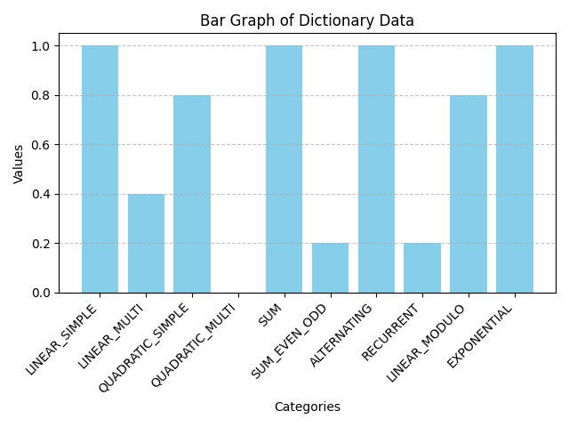

# Sequence Bench
**work in progress**

## Motivation
Modern LLMs have reached impressive performance on many benchmarks either due to capability increases or due to overfitting for certain datasets.
A very challenging dataset with complex input-output transformation was needed for our work on prompt optimization.
This dataset satisfies that while being easily verifiable automatically

## Findings
In the first iteration of the dataset with 10 sequence categories a small experiment was run on GPT-4o and GPT-4o mini.
The models achieve perfet accuracy in some categories while lacking in others.
What is interesting is that 4o-mini performs perfectly in QUADRATIC_MULTI where 4o does not get anything right.
Both models were tested with two similar prompt templates. Only difference is that in one the LLM was specifically instructed to reason 
in comments while programming (line marked with *) and in other it was not. 
```
You are given a zero-indexed integer sequence with 10 numbers. 
Your task is to generate a python function with the signature
'''python
def sequence_generator(i: int) -> int
'''
such that it generates the same number sequence for all i, starting with i=0.
Aim to create a general solution as simply as possible.
Only output python code without markdown formatting.
You are allowed to explain your reasoning in valid python comments. (*)
Sequence:
{seq}
```

- 4o-mini plain


- 4o-mini with reasoning


Notice performance in QUADRATIC_MULTI

- 4o plain


- 4o with reasoning



## Bigger experiment
50 samples per category, linear_simple and exponential discarded, on 4o-mini


